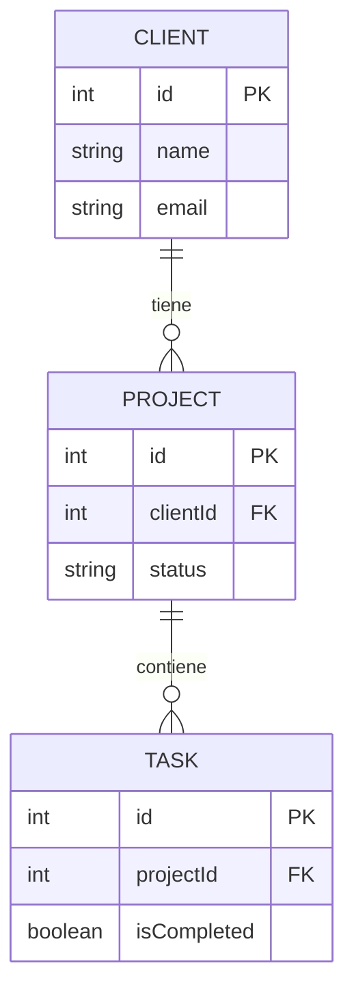

# Módulo 1: Hub de Proyectos (CRM) - Documentación Técnica

## Descripción General
El módulo "Hub de Proyectos" actúa como un CRM ligero integrado en la aplicación Aegis. Permite la gestión de Clientes, Proyectos y Tareas dentro de la "Bóveda" (entorno seguro y cifrado).

## Arquitectura y Componentes

### 1. Capa de Datos (Data Layer)
*   **Base de Datos (Room)**:
    *   `AegisDatabase`: Actualizada a versión 2.
    *   **Entidades**:
        *   `ClientEntity`: Representa un cliente (Nombre, Email, Teléfono, Notas).
        *   `ProjectEntity`: Representa un proyecto vinculado a un Cliente (`clientId` Foreign Key). Incluye estado y fecha límite.
        *   `TaskEntity`: Representa una tarea vinculada a un Proyecto (`projectId` Foreign Key). Incluye descripción y estado (completado/no completado).
    *   **DAO**:
        *   `CrmDao`: Define operaciones CRUD y consultas reactivas (`Flow`) para obtener "Proyectos Activos", listar clientes, etc.
*   **Repositorio**:
    *   `CrmRepository` (Interface) y `CrmRepositoryImpl`: Abstraen el acceso a datos. Inyectados mediante Hilt (`CrmModule`).

### 2. Capa de Presentación (UI Layer)
Utiliza **Jetpack Compose** y un **ViewModel** compartido (`CrmViewModel`) para la gestión del estado.

*   **Navegación**:
    *   Se implementó un `NavHost` anidado dentro del estado `Authenticated` de `MainScreen`.
    *   Rutas: `dashboard`, `clients`, `client_detail`, `project_detail`.

*   **Pantallas**:
    *   `DashboardScreen`: Vista principal. Muestra lista rápida de proyectos activos y acceso a clientes.
    *   `ClientListScreen`: Listado completo de clientes con funcionalidad de añadir (`FloatingActionButton`).
    *   `ClientDetailScreen`: Información del cliente y lista de sus proyectos.
    *   `ProjectDetailScreen`: Información del proyecto y lista de comprobación de tareas (`Checkbox`).

### 3. Seguridad
Todos los datos persisten en la base de datos `aegis_core.db` que está cifrada con **SQLCipher** (AES-256), utilizando la infraestructura de claves existente (`EncryptionKeyManager`).

## Diagrama de Datos Relacional

