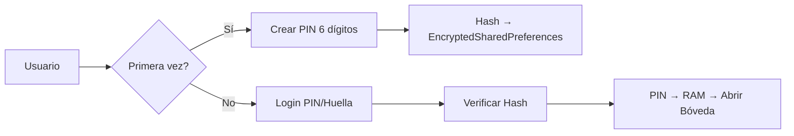
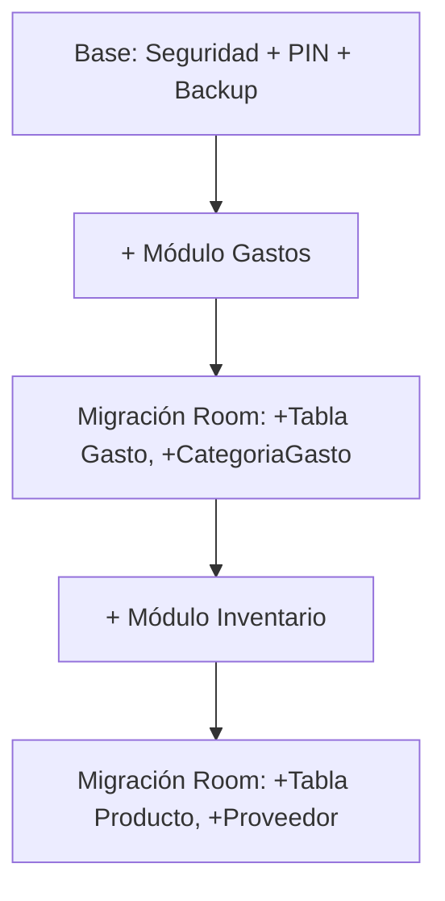

# 🏗️ Arquitectura y Seguridad de Aegis Core

> Este documento detalla el plan técnico del ecosistema "Bóveda Modular"

## Stack Tecnológico Principal

| Tecnología | Propósito |
|------------|-----------|
| **Kotlin 100%** | Lenguaje principal |
| **Jetpack Compose** | UI moderna declarativa (Material Design 3) |
| **MVVM** | Arquitectura Model-View-ViewModel |
| **Hilt** | Inyección de dependencias |
| **Coroutines + Flow** | Programación asíncrona y reactiva |

---

## 🔐 El Núcleo: La "Bóveda"

### Tecnología de Encriptación
```
┌──────────────────────────────────────────────────────────┐
│                    BÓVEDA AEGIS                          │
├──────────────────────────────────────────────────────────┤
│  Room (ORM)  →  SQLCipher (AES-256)  →  .db encriptado  │
└──────────────────────────────────────────────────────────┘
```

- **Room**: Capa de abstracción de Google sobre SQLite
- **SQLCipher**: Motor de encriptación que cifra el archivo físico
- **Resultado**: Si la app está cerrada, los datos son ilegibles

---

## Arquitectura de Seguridad

### 1. PIN Maestro / Biometría



| Aspecto | Implementación |
|---------|----------------|
| **Onboarding** | PIN de 6 dígitos obligatorio |
| **Almacenamiento** | Solo se guarda el HASH, nunca el PIN |
| **Llave** | PIN en memoria RAM solo mientras la app está abierta |
| **Acceso diario** | Huella dactilar (`androidx.biometric`) o PIN |

### 2. Sistema de Backup: "Seguro de Vida"

| Paso | Descripción |
|------|-------------|
| **Exportación** | JSON con todos los datos de la Bóveda |
| **Encriptación** | AES-256 con contraseña del usuario |
| **Archivo final** | `.boveda` (JSON encriptado, no texto plano) |
| **Plan B** | Kit de Recuperación (12 palabras aleatorias) |
| **Almacenamiento** | Storage Access Framework → Google Drive, OneDrive |
| **Recordatorio** | Notificación mensual para crear backup |

---

## 🧩 Bóveda Modular: El Sistema de Compra

### El Desafío
No podemos tener una base de datos "gigante" si el usuario solo compra un módulo.

### La Solución: Migraciones Inteligentes



**Resultado**: La Bóveda crece con los módulos comprados, manteniendo:
- ✅ Una única base de datos encriptada
- ✅ Un único sistema de backup
- ✅ Consistencia total de datos

---

## Diagrama de Capas

```
┌─────────────────────────────────────────────────────────┐
│                   PRESENTATION LAYER                     │
│         Jetpack Compose + ViewModels + Navigation        │
├─────────────────────────────────────────────────────────┤
│                     DOMAIN LAYER                         │
│           UseCases + Repositories (Interfaces)           │
├─────────────────────────────────────────────────────────┤
│                      DATA LAYER                          │
│     Room + SQLCipher + EncryptedSharedPreferences        │
└─────────────────────────────────────────────────────────┘
```

---

*Documento de arquitectura v1.0 - Aegis Core*
