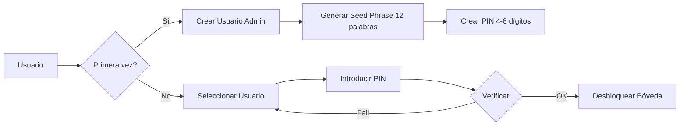
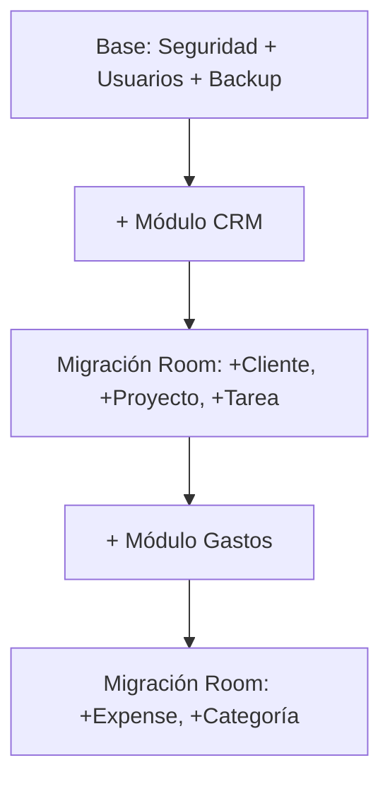
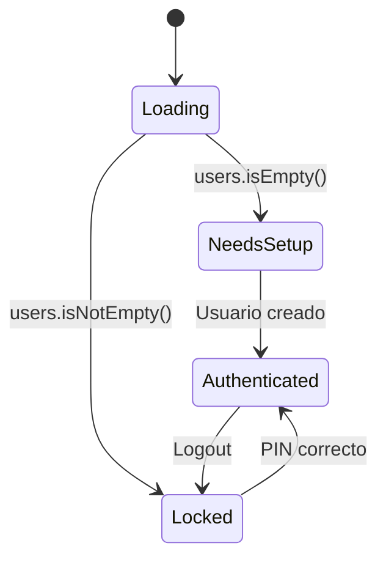

# 🏗️ Arquitectura y Seguridad de Aegis Core

> Este documento detalla el plan técnico del ecosistema "Bóveda Modular"

## Stack Tecnológico Principal

| Tecnología | Propósito |
|------------|-----------|
| **Kotlin 100%** | Lenguaje principal |
| **Jetpack Compose** | UI moderna declarativa (Material Design 3) |
| **MVVM** | Arquitectura Model-View-ViewModel |
| **Hilt** | Inyección de dependencias |
| **Coroutines + Flow** | Programación asíncrona y reactiva |

---

## 🔐 El Núcleo: La "Bóveda"

### Tecnología de Encriptación
```
┌──────────────────────────────────────────────────────────┐
│                    BÓVEDA AEGIS                          │
├──────────────────────────────────────────────────────────┤
│  Room (ORM)  →  SQLCipher (AES-256)  →  .db encriptado  │
└──────────────────────────────────────────────────────────┘
```

- **Room**: Capa de abstracción de Google sobre SQLite
- **SQLCipher**: Motor de encriptación que cifra el archivo físico
- **Resultado**: Si la app está cerrada, los datos son ilegibles

---

## Arquitectura de Seguridad Multi-Usuario

### 1. Sistema de Autenticación



### Flujo de Primera Configuración

| Paso | Acción | Almacenamiento |
|------|--------|----------------|
| 1 | Generar Master Key (MK) | RAM temporal |
| 2 | Generar Seed Phrase (12 palabras) | Mostrar al usuario |
| 3 | Usuario crea PIN | - |
| 4 | Wrap MK con PIN | EncryptedSharedPreferences (por usuario) |
| 5 | Wrap MK con Seed | EncryptedSharedPreferences (global) |
| 6 | Guardar usuario en Room | Base de datos |

### Flujo de Login

| Paso | Acción |
|------|--------|
| 1 | Seleccionar usuario de la lista |
| 2 | Introducir PIN |
| 3 | Recuperar PIN-Wrapped MK |
| 4 | Unwrap con PIN → Obtener MK |
| 5 | MK en RAM → Abrir Bóveda |

### 2. Entidad de Usuario

```kotlin
@Entity(tableName = "users")
data class UserEntity(
    @PrimaryKey(autoGenerate = true) val id: Int = 0,
    val name: String,
    val role: UserRole,        // ADMIN, USER, GUEST
    val language: String,      // "es", "en"
    val pricePerKm: Double,    // Configuración personal
    val biometricEnabled: Boolean
)
```

### 3. Sistema de Key Wrapping

```
┌─────────────────────────────────────────────────────────────┐
│                  ARQUITECTURA DE CLAVES                      │
├─────────────────────────────────────────────────────────────┤
│                                                              │
│   Master Key (AES-256)                                       │
│        │                                                     │
│        ├──→ PIN-Wrapped (por usuario)                        │
│        │      └── Almacenado: pin_wrapped_mk_{userId}        │
│        │                                                     │
│        └──→ Seed-Wrapped (global/recuperación)               │
│               └── Almacenado: recovery_wrapped_mk            │
│                                                              │
│   Cifrado: PBKDF2 + AES-GCM via KeyCryptoManager            │
└─────────────────────────────────────────────────────────────┘
```

### 4. Sistema de Backup: "Seguro de Vida"

| Paso | Descripción |
|------|-------------|
| **Exportación** | JSON con todos los datos de la Bóveda |
| **Encriptación** | AES-256 con contraseña del usuario |
| **Archivo final** | `.boveda` (JSON encriptado, no texto plano) |
| **Plan B** | Kit de Recuperación (12 palabras aleatorias) |
| **Almacenamiento** | Storage Access Framework → Google Drive, OneDrive |
| **Recordatorio** | Notificación mensual para crear backup |

---

## 🌐 Sistema de Internacionalización

### Idiomas Soportados

| Código | Idioma | Archivo |
|--------|--------|---------|
| `es` | Español | `values-es/strings.xml` |
| `en` | Inglés | `values/strings.xml` |

### Cambio de Idioma Dinámico y Protocolo i18n

El cambio de idioma se realiza en tiempo real sin reiniciar la app. Aegis Core sigue un **Protocolo i18n Strict Mode**:

- **Prohibición de Hardcoded Strings**: No se permiten textos literales en la capa de UI o ViewModel.
- **Dualidad XML**: Todo recurso de texto debe existir en `res/values/strings.xml` (EN) y `res/values-es/strings.xml` (ES).
- **Abstracción de Texto**: Los ViewModels emiten estados usando `UiText` para evitar dependencias directas con `Context` o recursos de Android.

```kotlin
// Ejemplo de implementación de cambio dinámico
val localizedContext = remember(language) {
    val locale = Locale(language)
    Locale.setDefault(locale)
    val config = context.resources.configuration
    config.setLocale(locale)
    context.resources.updateConfiguration(config, context.resources.displayMetrics)
    context.createConfigurationContext(config)
}
```

---

## 🧩 Bóveda Modular: El Sistema de Compra

### El Desafío
No podemos tener una base de datos "gigante" si el usuario solo compra un módulo.

### La Solución: Migraciones Inteligentes



**Resultado**: La Bóveda crece con los módulos comprados, manteniendo:
- ✅ Una única base de datos encriptada
- ✅ Un único sistema de backup
- ✅ Consistencia total de datos

---

## Diagrama de Capas

```
┌─────────────────────────────────────────────────────────┐
│                   PRESENTATION LAYER                     │
│    Jetpack Compose + ViewModels + Navigation Compose     │
│    (auth/, crm/, reports/, expenses/, inventory/, etc.)  │
├─────────────────────────────────────────────────────────┤
│                     DOMAIN LAYER                         │
│    UseCases (InitSetup, FinalizeSetup, LoginWithPin)    │
│              + Repositories (Interfaces)                 │
├─────────────────────────────────────────────────────────┤
│                      DATA LAYER                          │
│   Room + SQLCipher + EncryptedSharedPreferences          │
│   SecurityDataSource + KeyCryptoManager                  │
└─────────────────────────────────────────────────────────┘
```

---

## Estados de la Aplicación

### AuthState (en AuthViewModel)

```kotlin
sealed interface AuthState {
    data object Loading : AuthState       // Cargando usuarios de BD
    data object NeedsSetup : AuthState    // No hay usuarios, crear Admin
    data object Locked : AuthState        // Hay usuarios, seleccionar + PIN
    data object Authenticated : AuthState // Acceso concedido
}
```

### Transiciones de Estado



---

*Documento de arquitectura v1.2 - Aegis Core - Abril 2026*
