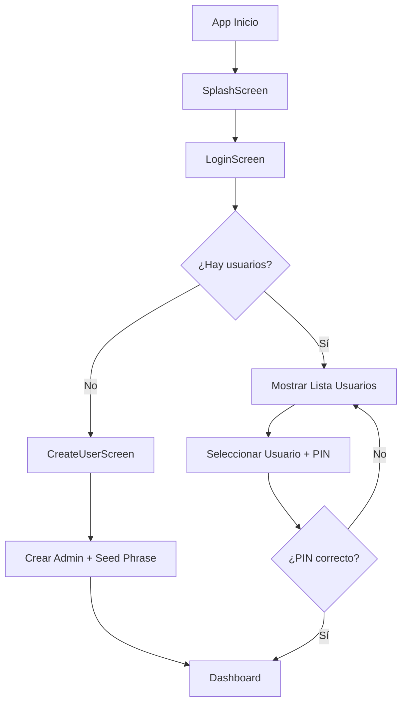
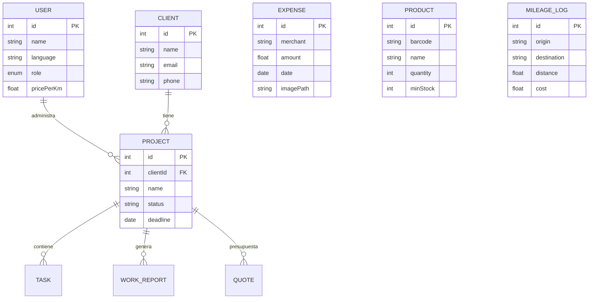

# 🔧 Documentación Técnica - Aegis Core

> Arquitectura, tecnologías y módulos implementados

---

## 1. Stack Tecnológico

| Categoría | Tecnología | Versión |
|-----------|------------|---------|
| **Lenguaje** | Kotlin | 1.9.20 |
| **UI** | Jetpack Compose | Material Design 3 |
| **DI** | Hilt | Latest |
| **Database** | Room + SQLCipher | AES-256 |
| **Navigation** | Navigation Compose | - |
| **Serialization** | Gson | - |

### Seguridad
- `androidx.security:security-crypto` → EncryptedSharedPreferences
- `androidx.biometric` → Autenticación huella/rostro
- `PBKDF2 + AES-GCM` → Encriptación manual de claves

### IA On-Device
- **ML Kit Text Recognition** → OCR en tickets
- **ML Kit Barcode Scanning** → Escáner de inventario

### Cámara
- **CameraX** → Análisis en tiempo real y captura

---

## 2. Arquitectura Clean

### Estructura de Paquetes

```
com.antigravity.aegis/
├── data/
│   ├── local/          # Room DB, Entities, DAOs
│   ├── repository/     # Implementaciones
│   ├── datasource/     # SecurityDataSource (EncryptedSharedPrefs)
│   ├── security/       # EncryptionKeyManager, KeyCryptoManager
│   └── di/             # Módulos Hilt (Auth, CRM, Database, Backup, Settings)
├── domain/
│   ├── repository/     # Interfaces
│   ├── usecase/        # Casos de uso (InitSetup, FinalizeSetup, LoginWithPin)
│   ├── reports/        # PdfGenerator
│   ├── expenses/       # OcrManager, ExportManager
│   └── inventory/      # BarcodeAnalyzer
└── presentation/
    ├── auth/           # SplashScreen, LoginScreen, CreateUserScreen, AuthViewModel
    ├── dashboard/      # DashboardScreen principal
    ├── crm/            # Dashboard CRM, Clients, Projects, Quotes
    ├── reports/        # WorkReports, SignatureCanvas, CreateReportScreen
    ├── expenses/       # ExpensesScreen + OCR
    ├── inventory/      # InventoryScreen + Scanner
    ├── mileage/        # MileageScreen
    ├── navigation/     # NavigationGraph, Screen sealed class
    └── theme/          # ThemeViewModel, AegisTheme
```

---

## 3. Flujo de Autenticación Multi-Usuario

### Arquitectura de Autenticación



### Estados de Autenticación (AuthState)

| Estado | Descripción |
|--------|-------------|
| `Loading` | Cargando usuarios de la base de datos |
| `NeedsSetup` | No hay usuarios, mostrar pantalla de creación |
| `Locked` | Usuarios existen, esperando selección + PIN |
| `Authenticated` | Usuario autenticado, acceso completo |

### Componentes Clave

| Componente | Archivo | Responsabilidad |
|------------|---------|-----------------|
| **AuthViewModel** | `presentation/auth/AuthViewModel.kt` | Gestión de estados, usuarios, idioma |
| **LoginScreen** | `presentation/auth/LoginScreen.kt` | UI de selección de usuario y PIN |
| **CreateUserScreen** | `presentation/auth/CreateUserScreen.kt` | Creación de nuevo usuario |
| **SplashScreen** | `presentation/auth/SplashScreen.kt` | Animación inicial del logo |
| **AuthRepository** | `domain/repository/AuthRepository.kt` | Interface de operaciones de auth |
| **AuthRepositoryImpl** | `data/repository/AuthRepositoryImpl.kt` | Implementación con Room + Security |
| **SecurityDataSource** | `data/datasource/SecurityDataSource.kt` | EncryptedSharedPreferences para claves |

### Sistema de Key Wrapping

```
┌─────────────────────────────────────────────────────────────┐
│                    KEY WRAPPING SYSTEM                       │
├─────────────────────────────────────────────────────────────┤
│  Master Key (MK) → Clave maestra para SQLCipher             │
│  PIN Wrap       → MK encriptada con PIN del usuario         │
│  Seed Wrap      → MK encriptada con frase de recuperación   │
│                                                              │
│  Almacenamiento: EncryptedSharedPreferences (per-user)      │
└─────────────────────────────────────────────────────────────┘
```

---

## 4. Sistema de Internacionalización

### Idiomas Soportados
- **Español (es)** - `/res/values-es/strings.xml`
- **Inglés (en)** - `/res/values/strings.xml` (default)

### Implementación en Compose

```kotlin
// En LoginScreen.kt
val localizedContext = remember(language) {
    val locale = Locale(language)
    Locale.setDefault(locale)
    val config = context.resources.configuration
    config.setLocale(locale)
    context.resources.updateConfiguration(config, context.resources.displayMetrics)
    context.createConfigurationContext(config)
}

// Forzar recomposición con key()
key(language) {
    // Contenido UI que se recompone al cambiar idioma
}
```

---

## 5. Entidades de Base de Datos



---

## 6. Módulos del Sistema

### Módulo 1: Hub de Proyectos (CRM)
| Componente | Descripción |
|------------|-------------|
| **Entidades** | Client, Project, Task |
| **Pantallas** | Dashboard, ClientList, ClientDetail, ProjectDetail |
| **ViewModel** | CrmViewModel (compartido) |

### Módulo 2: Partes de Trabajo
| Componente | Descripción |
|------------|-------------|
| **Firma Digital** | Canvas en Compose capturando Path del dedo |
| **PDF** | `android.graphics.pdf.PdfDocument` |
| **Cámara** | `ActivityResultContracts.TakePicture` |

### Módulo 3: Presupuestos
| Componente | Descripción |
|------------|-------------|
| **Kanban** | Estados: Draft → Sent → Won/Lost |
| **PDF** | Reutiliza PdfGenerator |

### Módulo 4: Gastos (OCR)
| Componente | Descripción |
|------------|-------------|
| **Smart Scan** | ML Kit Text Recognition |
| **Parsing** | RegEx para fecha (`\d{2}/\d{2}/\d{4}`) y total |
| **Export** | ZIP con CSV + imágenes |

### Módulo 5: Inventario
| Componente | Descripción |
|------------|-------------|
| **Scanner** | CameraX.ImageAnalysis en tiempo real |
| **Decodificación** | ML Kit Barcode (EAN-13, QR, UPC) |
| **Alertas** | Highlight visual stock bajo |

### Módulo 6: Kilometraje
| Componente | Descripción |
|------------|-------------|
| **Calculadora** | Odómetro inicio/fin |
| **Config** | Precio/Km en UserEntity |
| **Export** | CSV anual |

---

## 7. Modelo de Seguridad

```
┌─────────────────────────────────────────────────────────┐
│                  ZERO-KNOWLEDGE LOCAL                    │
├─────────────────────────────────────────────────────────┤
│  • Master Key nunca se guarda en plano                  │
│  • SQLCipher: BD encriptada AES-256                     │
│  • Key Wrapping: Clave protegida por PIN + Keystore     │
│  • Multi-usuario: Cada usuario tiene su PIN wrapped MK  │
│  • Recovery: Seed phrase de 12 palabras                 │
└─────────────────────────────────────────────────────────┘
```

---

## 8. Navegación

### Rutas Definidas (Screen sealed class)

| Ruta | Pantalla |
|------|----------|
| `splash` | SplashScreen |
| `login` | LoginScreen |
| `create_user` | CreateUserScreen |
| `dashboard` | DashboardScreen |
| `projects` | CRM DashboardScreen |
| `clients` | ClientListScreen |
| `client_detail` | ClientDetailScreen |
| `project_detail` | ProjectDetailScreen |
| `work_reports` | FieldServiceScreen |
| `budgets` | QuoteKanbanScreen |
| `expenses` | ExpensesScreen |
| `inventory` | InventoryScreen |
| `mileage` | MileageScreen |

---

## 9. Sistema de Temas

### ThemeViewModel

```kotlin
class ThemeViewModel : ViewModel() {
    var isDarkTheme by mutableStateOf(false)
        private set
    
    fun toggleTheme() {
        isDarkTheme = !isDarkTheme
    }
}
```

- Toggle disponible en DashboardScreen
- Persiste durante la sesión
- MaterialTheme con colorScheme dinámico

---

*Documentación Técnica v1.1 - Aegis Core - Enero 2026*
