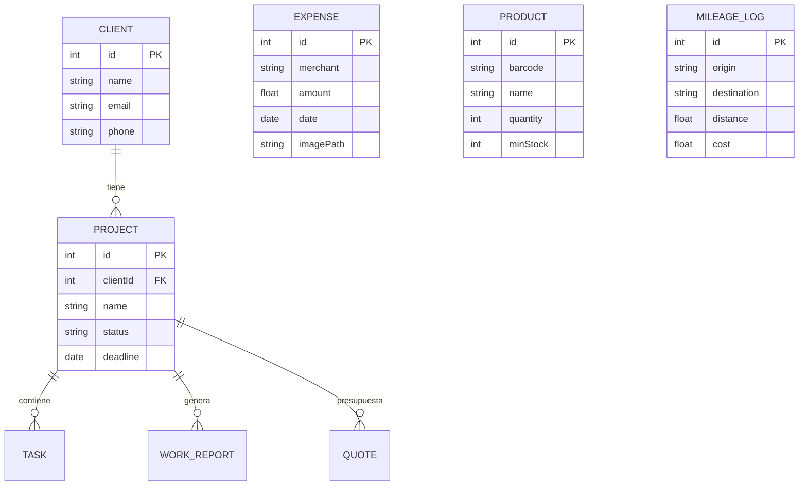

# 🔧 Documentación Técnica - Aegis Core

> Arquitectura, tecnologías y módulos implementados

---

## 1. Stack Tecnológico

| Categoría | Tecnología | Versión |
|-----------|------------|---------|
| **Lenguaje** | Kotlin | 1.9.20 |
| **UI** | Jetpack Compose | Material Design 3 |
| **DI** | Hilt | Latest |
| **Database** | Room + SQLCipher | AES-256 |
| **Navigation** | Navigation Compose | - |
| **Serialization** | Gson | - |

### Seguridad
- `androidx.security:security-crypto` → EncryptedSharedPreferences
- `androidx.biometric` → Autenticación huella/rostro
- `PBKDF2 + AES-GCM` → Encriptación manual de claves

### IA On-Device
- **ML Kit Text Recognition** → OCR en tickets
- **ML Kit Barcode Scanning** → Escáner de inventario

### Cámara
- **CameraX** → Análisis en tiempo real y captura

---

## 2. Arquitectura Clean

### Estructura de Paquetes

```
com.antigravity.aegis/
├── data/
│   ├── local/          # Room DB, Entities, DAOs
│   ├── repository/     # Implementaciones
│   ├── security/       # EncryptionKeyManager, BiometricManager
│   └── di/             # Módulos Hilt
├── domain/
│   ├── repository/     # Interfaces
│   ├── usecase/        # Casos de uso
│   ├── reports/        # PdfGenerator
│   ├── expenses/       # OcrManager, ExportManager
│   └── inventory/      # BarcodeAnalyzer
└── presentation/
    ├── auth/           # Login, Setup screens
    ├── crm/            # Dashboard, Clients, Projects
    ├── reports/        # WorkReports, SignatureCanvas
    ├── expenses/       # ExpensesScreen + OCR
    ├── inventory/      # InventoryScreen + Scanner
    └── mileage/        # MileageScreen
```

---

## 3. Entidades de Base de Datos



---

## 4. Módulos del Sistema

### Módulo 1: Hub de Proyectos (CRM)
| Componente | Descripción |
|------------|-------------|
| **Entidades** | Client, Project, Task |
| **Pantallas** | Dashboard, ClientList, ClientDetail, ProjectDetail |
| **ViewModel** | CrmViewModel (compartido) |

### Módulo 2: Partes de Trabajo
| Componente | Descripción |
|------------|-------------|
| **Firma Digital** | Canvas en Compose capturando Path del dedo |
| **PDF** | `android.graphics.pdf.PdfDocument` |
| **Cámara** | `ActivityResultContracts.TakePicture` |

### Módulo 3: Presupuestos
| Componente | Descripción |
|------------|-------------|
| **Kanban** | Estados: Draft → Sent → Won/Lost |
| **PDF** | Reutiliza PdfGenerator |

### Módulo 4: Gastos (OCR)
| Componente | Descripción |
|------------|-------------|
| **Smart Scan** | ML Kit Text Recognition |
| **Parsing** | RegEx para fecha (`\d{2}/\d{2}/\d{4}`) y total |
| **Export** | ZIP con CSV + imágenes |

### Módulo 5: Inventario
| Componente | Descripción |
|------------|-------------|
| **Scanner** | CameraX.ImageAnalysis en tiempo real |
| **Decodificación** | ML Kit Barcode (EAN-13, QR, UPC) |
| **Alertas** | Highlight visual stock bajo |

### Módulo 7: Kilometraje
| Componente | Descripción |
|------------|-------------|
| **Calculadora** | Odómetro inicio/fin |
| **Config** | Precio/Km en UserConfig |
| **Export** | CSV anual |

---

## 5. Modelo de Seguridad

```
┌─────────────────────────────────────────────────────────┐
│                  ZERO-KNOWLEDGE LOCAL                    │
├─────────────────────────────────────────────────────────┤
│  • Master Key nunca se guarda en plano                  │
│  • SQLCipher: BD encriptada AES-256                     │
│  • Key Wrapping: Clave protegida por PIN + Keystore     │
└─────────────────────────────────────────────────────────┘
```

---

## 6. Sistema de Backup (.boveda)

Exportación segura de datos:
- **Formato**: JSON comprimido y encriptado
- **Clave**: Contraseña personalizada del usuario
- **Portabilidad**: Compatible entre dispositivos

---

*Documentación Técnica v1.0 - Aegis Core*
