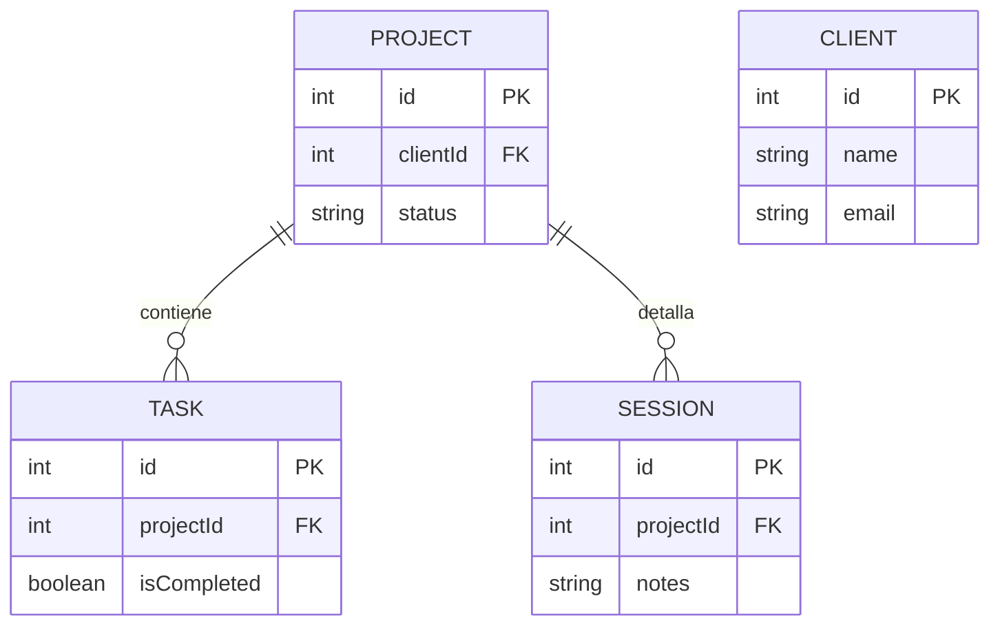
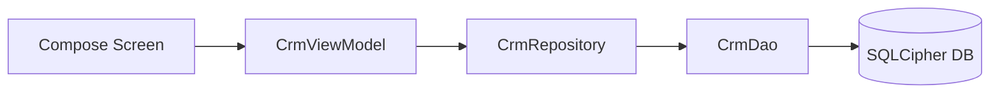

# 🔧 Módulo CRM - Documentación Técnica

> Hub de Proyectos: Implementación técnica

---

## Descripción General

El módulo "Hub de Proyectos" actúa como un **CRM ligero** integrado en Aegis. Gestiona Clientes, Proyectos y Tareas dentro de la "Bóveda" (entorno seguro y cifrado).

---

## Arquitectura

### 1. Capa de Datos

#### Base de Datos (Room)

| Componente | Descripción |
|------------|-------------|
| **AegisDatabase** | Versión 34 |
| **Entities** | ClientEntity, ProjectEntity, TaskEntity, SessionEntity |
| **DAO** | CrmDao, SessionDao con operaciones CRUD y consultas Flow |

#### Entidades

```kotlin
@Entity(tableName = "clients")
data class ClientEntity(
    @PrimaryKey(autoGenerate = true) val id: Int,
    val name: String,
    val email: String?,
    val phone: String?,
    val notes: String?
)

@Entity(tableName = "projects", foreignKeys = [...])
data class ProjectEntity(
    @PrimaryKey(autoGenerate = true) val id: Int,
    val clientId: Int,  // FK → ClientEntity
    val name: String,
    val status: String,
    val deadline: Long?
)

@Entity(tableName = "tasks", foreignKeys = [...])
data class TaskEntity(
    @PrimaryKey(autoGenerate = true) val id: Int,
    val projectId: Int,  // FK → ProjectEntity
    val description: String,
    val isCompleted: Boolean
)

@Entity(tableName = "sessions", foreignKeys = [...])
data class SessionEntity(
    @PrimaryKey(autoGenerate = true) val id: Int,
    val projectId: Int, // FK → ProjectEntity
    val date: Long,
    val location: String,
    val duration: String,
    val notes: String,
    val exercises: String,
    val nextSessionDate: Long?,
    val googleCalendarEventId: String?
)
```

#### Repositorio
- **Interface**: `CrmRepository`, `SessionRepository`
- **Implementación**: `CrmRepositoryImpl`, `SessionRepositoryImpl`
- **Inyección**: `CrmModule`, `SessionModule` (Hilt)

---

### 2. Capa de Presentación

| Componente | Descripción |
|------------|-------------|
| **ViewModel** | `CrmViewModel` (compartido) |
| **Navegación** | NavHost anidado en estado Authenticated |

#### Rutas de Navegación
```
dashboard → clients → client_detail/{id} → project_detail/{id}
```

#### Pantallas

| Screen | Función |
|--------|---------|
| `DashboardScreen` | Vista principal con proyectos activos |
| `ClientListScreen` | Listado con FAB para añadir |
| `ClientDetailScreen` | Info cliente + lista proyectos (filtrado raíz) |
| `ProjectDetailScreen` | Info proyecto + checklist tareas + Sesiones |

---

### 3. Seguridad

Todos los datos persisten en `aegis_core.db`:
- Encriptado con **SQLCipher (AES-256)**
- Utiliza `EncryptionKeyManager` para la clave

---

## Diagrama de Datos



---

## Flujo de Datos



---

*Documentación Técnica CRM v1.2.1 - Aegis Core - Abril 2026*
