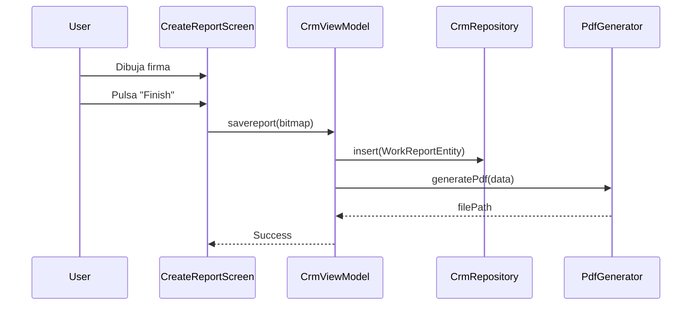

# 🔧 Módulo Reportes - Documentación Técnica

> Field Service: Implementación de partes de trabajo

---

## Descripción General

Permite crear **Partes de Trabajo** in situ con:
- Firma digital del cliente
- Fotografías del trabajo
- Generación automática de PDF

---

## Arquitectura

### 1. Capa de Datos

#### Base de Datos
| Componente | Descripción |
|------------|-------------|
| **AegisDatabase** | Versión 3+ |
| **WorkReportEntity** | Vinculado a ProjectEntity |

#### Entidad

```kotlin
@Entity(tableName = "work_reports", foreignKeys = [...])
data class WorkReportEntity(
    @PrimaryKey(autoGenerate = true) val id: Int,
    val projectId: Int,        // FK → ProjectEntity
    val description: String,
    val date: Long,            // Timestamp
    val signaturePath: String?, // Ruta archivo firma
    val photoPaths: String?    // Lista serializada de rutas
)
```

---

### 2. Componentes Clave

#### Captura de Firma (`SignatureCanvas`)

```kotlin
// AndroidView personalizada en Compose
Canvas(modifier = Modifier.fillMaxSize()) {
    // Captura MotionEvent → dibuja Path
    // Exporta como Bitmap
}
```

| Característica | Implementación |
|----------------|----------------|
| **Input** | `MotionEvent` (ACTION_DOWN, MOVE, UP) |
| **Rendering** | Canvas con Path |
| **Output** | Bitmap → archivo PNG |

#### Generación PDF (`PdfGenerator`)

```kotlin
val document = PdfDocument()
val pageInfo = PdfDocument.PageInfo.Builder(595, 842, 1).create() // A4
val page = document.startPage(pageInfo)
val canvas = page.canvas

// Dibujar contenido
canvas.drawText(title, x, y, paint)
canvas.drawBitmap(signatureBitmap, x, y, null)

document.finishPage(page)
document.writeTo(outputStream)
document.close()
```

#### Cámara

| Contrato | Uso |
|----------|-----|
| `TakePicturePreview` | Prototipado rápido (Bitmap) |
| `TakePicture` | Producción (FileProvider + Uri) |

---

### 3. Capa de Presentación

#### CreateReportScreen

| Componente | Función |
|------------|---------|
| TextField | Descripción del trabajo |
| Button (Camera) | Lanzar captura foto |
| SignatureCanvas | Área de firma interactiva |
| Button (Finish) | Guardar + generar PDF |

#### Integración
Accesible desde `ProjectDetailScreen` → botón "Create Work Report"

---

## Flujo de Datos



---

## Archivos Generados

| Tipo | Ubicación |
|------|-----------|
| **Firmas** | `context.filesDir/signatures/` |
| **Fotos** | `context.filesDir/photos/` |
| **PDFs** | `context.filesDir/reports/` |

---

## Dependencias

```kotlin
// Manifest
<uses-permission android:name="android.permission.CAMERA" />

// FileProvider para compartir PDFs
<provider
    android:authorities="${applicationId}.provider"
    android:name="androidx.core.content.FileProvider"
    ...>
```

---

*Documentación Técnica Reportes v1.0 - Aegis Core*
